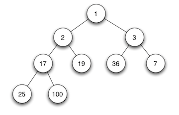

# 最大堆

一、堆树的定义

堆树的定义如下：

（1）堆树是一颗完全二叉树；

（2）堆树中某个节点的值总是不大于或不小于其孩子节点的值；

（3）堆树中每个节点的子树都是堆树。

当父节点的键值总是大于或等于任何一个子节点的键值时为最大堆。 当父节点的键值总是小于或等于任何一个子节点的键值时为最小堆。如下图所示，下为最大堆，上为最小堆。  





二、堆树的操作

以最大堆为例进行讲解，最小堆同理。  
原始数据为a\[\] = {4, 1, 3, 2, 16, 9, 10, 14, 8, 7}，采用顺序存储方式，对应的完全二叉树如下图所示：  


（1）构造最大堆

在构造堆的基本思想就是：  
首先将每个叶子节点视为一个堆，再将每个叶子节点与其父节点一起构造成一个包含更多节点的堆。所以，在构造堆的时候，首先需要找到最后一个节点的父节点，从这个节点开始构造最大堆；直到该节点前面所有分支节点都处理完毕，这样最大堆就构造完毕了。假设树的节点个数为n，以1为下标开始编号，直到n结束。对于节点i，其父节点为i/2；左孩子节点为i\*_2，右孩子节点为i\*_2+1。最后一个节点的下标为n，其父节点的下标为n/2。  
如下图所示，最后一个节点为7，其父节点为16，从16这个节点开始构造最大堆；构造完毕之后，转移到下一个父节点2，直到所有父节点都构造完毕。


C++代码实现：

定义存放堆的结构如下：strcut MaxHeap

```text

strcut MaxHeap
{
	Etype *heap;
	int HeapSize;
	int MaxSize;
};
MaxHeap H;
```

其中，heap是数据元素存放的空间，下标从1开始存数数据，下标为0的作为工作空间，存储临时数据。HeapSize是数据元素的个数，MaxSize是存放数据元素空间的大小。

初始化堆方法如下：

```text

void MaxHeapInit (MaxHeap &H)
{
	for(int i = H.HeapSize/2; i>=1; i--)
	{
		H.heap[0] = H.heap[i];
		int son = i*2;
		while(son <= H.HeapSize)
		{
			if(son < H.HeapSize && H.heap[son] < H.heap[son+1])
				son++;
			if(H.heap[0] >= H.heap[son])
				break;
			else
			{
				H.heap[son/2] = H.heap[son];
				son *= 2;
			}
		}
		H.heap[son/2] = H.heap[0];
	}


```

（2）最大堆中插入节点

最大堆的插入节点的思想就是先在堆的最后添加一个节点，然后沿着堆树上升。跟最大堆的初始化过程大致相同。

C++代码实现：

```text

void MaxHeapInsert (MaxHeap &H, EType &x)
{
	if(H.HeapSize == H.MaxSize)
		return false;
	int i = ++H.HeapSize;
	while(i!=1 && x>H.heap[i/2])
	{
		H.heap[i] = H.heap[i/2];
		i = i/2;
	}
	H.heap[i] = x;
	return true;
}

```

（3）最大堆中堆顶节点的删除

最大堆堆顶节点删除思想如下：将堆树的最后的节点提到根结点，然后删除最大值，然后再把新的根节点放到合适的位置。

C++代码实现：

```text
void MaxHeapDelete (MaxHeap &H, EType &x)
{
	if(H.HeapSize == 0)
		return false;
	x = H.heap[1];
	H.heap[0] = H.heap[H.HeapSize--];
	int i = 1, son = i*2; 
 
	while(son <= H.HeapSize)
	{
		if(son <= H.HeapSize && H.heap[0] < H.heap[son+1])
			son++;
		if(H.heap[0] >= H.heap[son])
			break;
		H.heap[i] = H.heap[son];
		i = son;
		son  = son*2;
	}
	H.heap[i] = H.heap[0];
	return true;
}


```

## 三、堆树的应用

利用最大堆、最小堆进行排序。  


### 


